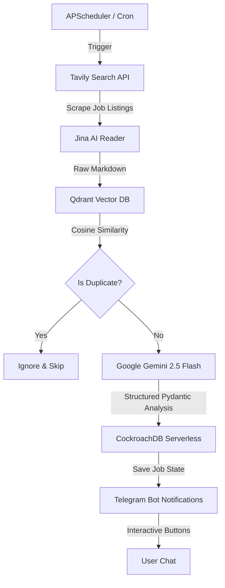

# Job Hunter AI 🚀

An autonomous, production-grade AI Agent that automates the job search lifecycle: scanning multiple job boards, performing semantic deduplication using vector embeddings, evaluating role fit with Gemini 2.5, and drafting highly tailored, context-aware cover letters.

---

## 🌟 System Architecture



---

## 🚀 Key Engineering Pillars

### 🧠 Structured LLM Reasoning (Gemini 2.5)
Instead of returning raw text, the AI agent evaluates job postings using strict **Pydantic schemas**. Gemini outputs a structured JSON response containing:
- **Match Score (0-100%)** based on the candidate's target profile.
- **Red Flags** (e.g., outdated stack, mismatched requirements, unclear expectations).
- **Tailored Cover Letter** customized to the specific job details using the candidate's professional bio and achievements.

### 🔍 Semantic Deduplication (Qdrant Vector DB)
To prevent showing the same job posting twice (even if published on different sites with minor wording changes), the app:
1. Converts the job title and snippet into a vector embedding.
2. Performs a cosine similarity search on **Qdrant Cloud**.
3. Gates the pipeline: if a similar posting exists above the `0.85` similarity threshold, it is automatically skipped.

### ⚡ Distributed SQL Architecture (CockroachDB)
User profiles, verified states, OTP codes, and job application tracking are stored in a distributed **CockroachDB Serverless** database using the modern **SQLModel** (SQLAlchemy + Pydantic) ORM, ensuring high availability and ACID compliance.

### 🤖 Interactive User Experience (Telegram Bot)
Built with **Aiogram 3**, the Telegram bot serves as the command center:
- Secure **email OTP authentication** against a trusted user whitelist.
- Dynamic target role updates via `/set_title`.
- Rich notification cards with inline callback buttons (`✅ Applied` / `❌ Reject`) that update application states in CockroachDB in real time.

---

## 🛠️ Technology Stack

- **Backend:** Python 3.13, `uv` (fast package manager), `pydantic-settings`
- **Scheduler:** `APScheduler`
- **Databases:** CockroachDB, Qdrant Cloud
- **APIs:** Google Gemini (google-genai), Tavily AI Search, Jina Reader
- **Infrastructure:** AWS EC2, Terraform (IaC), Docker
- **CI/CD:** GitHub Actions, GitHub Container Registry (GHCR)

---

## 💻 Quick Start

### 1. Local Run
To start the bot and scheduler locally:
```bash
make run
```

### 2. Infrastructure & Deploy
The infrastructure is completely declarative. To provision AWS resources and deploy the latest Dockerized version:
```bash
terraform apply -auto-approve
make deploy
```
