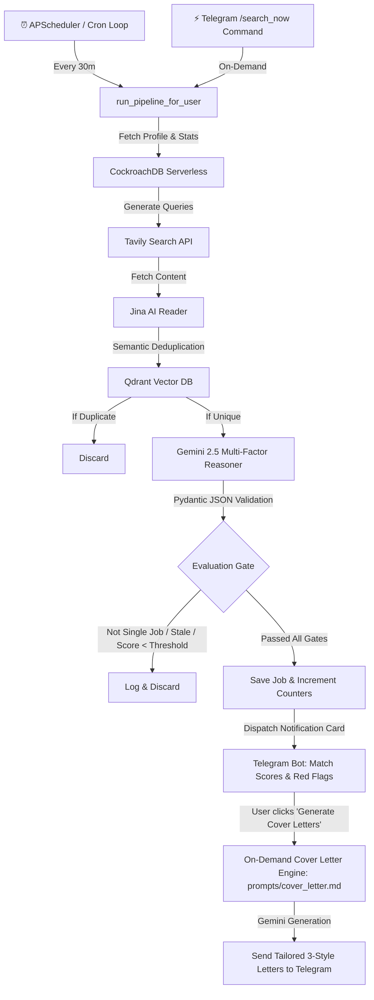

# Architecture

Agreed design for **Job Applicator (ApplyBot)** (pet project). Source of truth for structure, database schemas, and key decisions.

---

## 🏛️ System Overview & Pipeline Flow



---

## 🔑 Decisions (Locked & Upgraded)

- **Infrastructure:** Hosted on AWS EC2 (t3.micro, Ubuntu, Frankfurt). Databases are outsourced to managed cloud free tiers (CockroachDB Serverless & Qdrant Cloud) to minimize server resource consumption.
- **Relational DB (CockroachDB):** Used for strict state management (users, job URLs, application statuses). 
  - **Single Source of Truth = SQLModel:** `storage/models.py` (SQLModel table classes) IS the schema. `storage/db.py` runs `SQLModel.metadata.create_all(engine)` at startup via standard PostgreSQL dialect connection string.
- **Vector DB (Qdrant Cloud):** Used for semantic vector embeddings and deduplication (cosine similarity threshold `0.85`).
- **Zero Disk Secrets (AWS SSM Parameter Store):** Secrets are dynamically fetched into Docker container memory at launch without writing plain `.env` files to the server disk.
- **Composition Root (`clients.py`):** External API clients (Gemini, Tavily, Jina Reader, Qdrant Cloud) are initialized once from `Config` in `clients.py`.

---

## 👤 User Profile, Metrics & Dynamic Resume Ingestion

Candidate context, search preferences, and sent job metrics are stored dynamically in dedicated columns on the `User` model:

```python
class User(SQLModel, table=True):
    __tablename__ = "users"

    telegram_chat_id: int = Field(primary_key=True)
    email: str | None = Field(default=None, unique=True, index=True)
    otp: str | None = None
    otp_expires: int | None = None
    verified: int = Field(default=0)
    desired_title: str | None = None

    # 👤 Candidate Profile Fields (Populated via PDF or Commands)
    years_experience: int | None = None
    top_skills: list[str] = Field(default_factory=list, sa_column=Column(JSON))
    key_achievements: list[str] = Field(default_factory=list, sa_column=Column(JSON))
    preferred_location: str | None = None
    min_salary: str | None = None
    bio_summary: str | None = None

    # 🎯 Match Quality Settings
    min_match_score: int = Field(default=75)  # Only notify if score >= 75%
```

### 📄 Multimodal PDF Resume Parser
Users can send their resume PDF to the Telegram bot (`/upload_resume`). The bot passes the raw PDF bytes directly to **Gemini 2.5 Flash** (using its native multimodal capabilities), extracting all structured fields with zero external OCR/PDF libraries.

---

## ⚡ Dual-Trigger Search Execution Architecture

Search operations are encapsulated in a single, reusable function: `run_pipeline_for_user(user_id: int) -> tuple[int, int, int]`:
1. **Scheduled Hunt (Background):** Triggered automatically every 30 minutes by `APScheduler` for all verified users.
2. **On-Demand Hunt (Direct Command):** Triggered immediately when a user sends **`/search_now`** (or **`/hunt`**) in Telegram, providing real-time progress feedback.

---

## 🧠 Multi-Factor Job Evaluation & Quality Gate

Instead of a single opaque number, Gemini evaluates job postings against 4 specific dimensions and gates:

```python
class JobAnalysisResult(TypedDict):
    # 🚫 1. Quality & Catalog Gate
    is_single_job_posting: bool  # True ONLY if this page is a single job ad. False if list/catalog.
    is_active_and_fresh: bool  # True if open and recent. False if expired/closed.

    # 🎯 2. Detailed Dimension Scores (0-100)
    stack_match_score: int  # 0-100 score matching candidate skills and required stack
    seniority_match_score: int  # 0-100 score matching years of experience vs requirements
    location_salary_match_score: int  # 0-100 score matching work format & compensation
    overall_match_score: int  # Weighted average compatibility score (0-100)

    # ⚠️ 3. Red Flags & Analysis
    red_flags: list[str]  # Warning signs (outdated stack, unpaid test tasks, ambiguous pay)
    company_summary: str  # 1-2 sentence company & role overview
    fit_summary: str  # 2-3 concise sentences explaining match rationale
```

### 🛡️ Filter Gate Logic
The scheduler discards postings immediately if:
1. `is_single_job_posting == False` (kills aggregator/catalog pages).
2. `is_active_and_fresh == False` (kills closed/stale postings).
3. `overall_match_score < user.min_match_score` (guarantees $\ge 75\%$ relevance).

---

## 📝 On-Demand Custom Cover Letter Engine (`prompts/cover_letter.md`)

Cover letters are generated **on-demand** only when the user clicks the action button:

1. **Custom Markdown Prompt:** The master prompt instructions live in `src/job_applicator/prompts/cover_letter.md`. The user can edit rules, tone, and templates in this file without modifying Python code.
2. **Context Fusion:** When the user clicks `[ 📝 Generate Cover Letters ]` on a Telegram card, the engine dynamically injects:
   - Candidate context (`user.top_skills`, `user.key_achievements`, `user.years_experience`)
   - Scraped job description & requirements
   - Master prompt instructions from `cover_letter.md`
3. **Structured TypedDict Output:** Gemini returns 3 distinct variants parsed via native `json.loads()`:
   ```python
   class CoverLetterVariants(TypedDict):
       variant_1: str  # Concise, natural B2 English (<500 chars)
       variant_2: str  # Alternative angle/hook (<500 chars)
       variant_3: str  # Technical hook focus (<500 chars)
   ```

---

## 💬 Telegram Interface & Commands

| Command | Action |
| :--- | :--- |
| **`/start`** | Authentication flow (Email + OTP verification) |
| **`/search_now`** | Trigger on-demand live job hunt immediately (alias: `/hunt`) |
| **`/profile`** | View all candidate profile parameters and live activity stats |
| **`/upload_resume`** | Upload PDF resume to auto-fill all profile fields |
| **`/set_title`** | Update target search role |
| **`/set_skills`** | Update key skills list |
| **`/set_location`** | Update preferred locations and remote preference |
| **`/set_salary`** | Update minimum compensation |
| **`/set_min_score`** | Update relevance filter threshold (default: `75`) |
| **`/status`** | View bot health, DB status, and last search metrics |

### Interactive Job Notification Card
```
🎯 Senior Golang Developer @ TechCorp
📊 Overall Fit: 92%
• 🛠️ Stack Match: 95% (Go, gRPC, PostgreSQL, Docker)
• 📈 Seniority Match: 90% (Matches 3+ years)
• 📍 Location: Remote (EU) ✅

🏢 Fit Summary:
High match for high-throughput distributed backend architecture.

⚠️ Red Flags:
• Mentions occasional weekend on-call rotation.

[ 📝 Generate Cover Letters ]
[ ✅ Applied ]   [ ❌ Reject ]
```

---

## 🔭 Observability, Logging & Monitoring Architecture

To ensure 100% production visibility, track background failures, and master industry-standard monitoring practices, the service implements a 3-tier Observability stack:

```
                          ┌─────────────────────────────────────┐
                          │       Job Applicator Service        │
                          └──────────────────┬──────────────────┘
                                             │
             ┌───────────────────────────────┼───────────────────────────────┐
             ▼                               ▼                               ▼
   1. Structured JSON Logs          2. Sentry (Error APM)          3. Grafana Cloud
   ───────────────────────          ─────────────────────          ─────────────────
   • Standard JSON format           • Unhandled exception captures • Loki (LogQL query search)
   • Rich context (user, latency)   • Background task error alerts • Prometheus (Live metrics)
   • 0-overhead Python logging      • External API latency spans   • Visual Monitoring Dashboard
```

### 1. 📝 Structured JSON Logging
All application logs are emitted in a standardized, machine-parsable JSON format to `stdout`:
```json
{
  "timestamp": "2026-09-16T10:15:00.123Z",
  "level": "INFO",
  "logger": "job_applicator.scheduler",
  "event": "job_evaluation_completed",
  "message": "Evaluated job against candidate profile",
  "user_id": 123456789,
  "match_score": 92,
  "is_single_job": true,
  "latency_ms": 840,
  "job_url": "https://djinni.co/jobs/123"
}
```
* **Why:** Enables instant querying and filtering in modern log aggregators without complex regex parsing.

### 2. 🚨 Sentry (Error Tracking & APM Performance)
* **Role:** Real-time crash detection and distributed tracing.
* **Capabilities:**
  * Captures unhandled exceptions inside async loops (`APScheduler`, Telegram callbacks).
  * Sends instant notifications when external dependencies fail (Gemini rate limits, CockroachDB timeouts, Tavily search errors).
  * Measures latency spans for AI reasoning and database transactions.

### 3. 📊 Grafana Cloud (Loki + Prometheus + Grafana)
* **Grafana Loki:** Centralized cloud log stream. Search logs in real time using `LogQL` (e.g. `{app="job-applicator"} | json | match_score >= 80`).
* **Prometheus:** Exposes application metrics (total search runs, jobs discovered vs filtered, Gemini latency).
* **Grafana Dashboards:** Single-pane-of-glass dashboard displaying real-time bot health, search volume, and application stats.

---

## 🚫 Architectural Decision Record: Why Native TypedDict & Zero LangChain?

We deliberately use **standard library `TypedDict` and native JSON** in this service for the following reasons:
1. **Ultra-Fast & Zero Runtime Overhead:** Standard Python `TypedDict` operates directly on native C dictionaries, running **2.5x faster** with lower memory consumption than heavier validation layers.
2. **Native Gemini JSON Schema Support:** The official `google-genai` SDK natively supports `TypedDict` for `response_schema`, producing valid JSON that is cleanly parsed via standard `json.loads()`.
3. **Low Latency & Minimal Footprint:** Keeping memory usage under ~120MB on AWS `t3.micro` without heavy third-party framework dependencies. Pure Python + TypedDict + SQLModel follows Go-like explicit architecture principles.